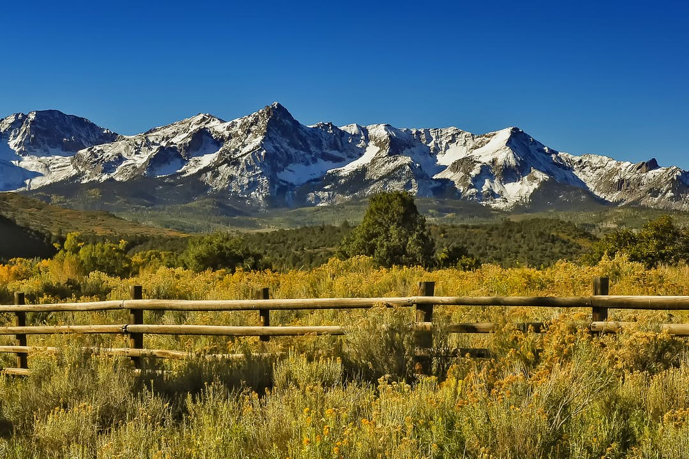

# Welcome to MkDocs

For full documentation visit [mkdocs.org](https://www.mkdocs.org).

## Commands

* `mkdocs new [dir-name]` - Create a new project.
* `mkdocs serve` - Start the live-reloading docs server.
* `mkdocs build` - Build the documentation site.
* `mkdocs -h` - Print help message and exit.

## Project layout

    mkdocs.yml    # The configuration file.
    docs/
        index.md  # The documentation homepage.
        ...       # Other markdown pages, images and other files.

## Description
* `mkdocs -h` - Print help message and exit.
* `mkdocs -h` - Print help message and exit.

    mkdocs.yml    # The configuration file.
    docs/
        index.md  # The documentation homepage.
        ...       # Other markdown pages, images and other files.

|  Exemplo  | Valor do exemplo |
|:---------:|:----------------:|
| Exemplo 1 |      R$ 10       |
| Exemplo 2 |       R$ 8       |
| Exemplo 3 |       R$ 7       |
| Exemplo 4 |       R$ 8       |

